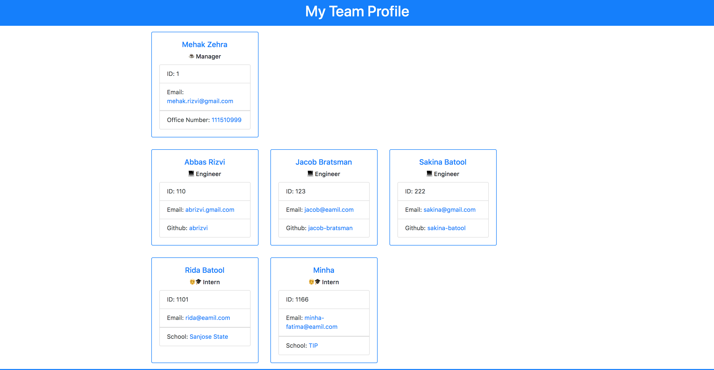

# Team Profile Generator
  ## Description  
  A Node.js command-line application that takes in information about employees on a software engineering team and generates an HTML webpage that displays summaries for each person.

  ## Table Of Content  
  * [Installation](#installation)
  * [Usage](#usage)
  
  * [Contributor](#contributor)
  * [Test](#test)
  * [Questions](#questions)

  ## Installation  
  To install dependencies run this command 

  ```npm install inquirer and npm install jest --save-dev```(for unit testing)

  ## Usage  
  This application can be used by a software engineering  who wants to generate a nice team profile. User will be prompted with different questions about their team. Answers all of the following questions, once you're finished with the profile. File will be generated in the dist directory and User can also open it in the default browser.

  ## License  
    None

## Screenshots

  
  
  
  ## Video Walk-through
  ### Part-1
  https://youtu.be/gAwhNzZ6TzY
  ### Part-2
  https://youtu.be/M84QzQhAyzA
  
  
  ## Technologies

    Node.js
    OOP
    NPM
    Inquirer.js
    open.js package
    Jest
    HTML
    Bootstrap

  ## Contributor  
  Mehak Zehra ♥ 

  ## Test  
  ```npm run test```
  ## Questions  
  - - -
  For questions about this project, please see my GitHub at [mehak-zehra](https://github.com/mehak-zehra)  (Or) 

  Contact me at mehak.rizvi.786@gmail.com